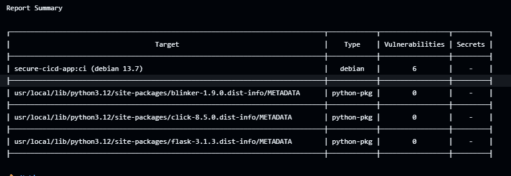
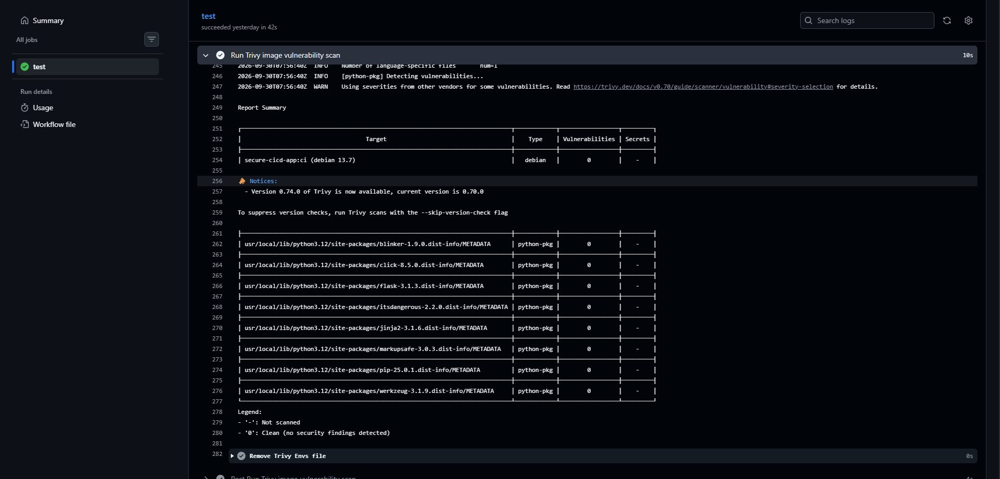
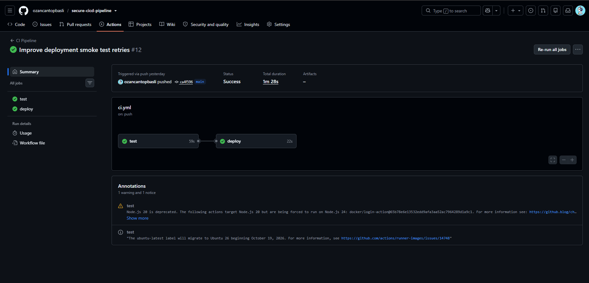

# Secure CI/CD Pipeline

A practical DevSecOps project that implements an automated CI/CD pipeline with testing, security scanning, containerization, image publishing, and deployment to a Linux server.

The main goal of the project is to demonstrate how security controls can be integrated directly into the software delivery lifecycle instead of being performed as a separate manual process.

---

## Architecture

```text
Developer
    |
    | git push
    v
GitHub Repository
    |
    v
GitHub Actions
    |
    +--> Automated Tests (pytest)
    |
    +--> SAST (Bandit)
    |
    +--> Dependency Scan (pip-audit)
    |
    +--> Docker Image Build
    |
    +--> Container Image Scan (Trivy)
    |
    v
GitHub Container Registry (GHCR)
    |
    | SHA-tagged image
    v
EC2 Self-Hosted GitHub Runner
    |
    +--> Pull Image
    |
    +--> Start Candidate Container
    |
    +--> Candidate Smoke Test
    |
    +--> Production Deployment
    |
    +--> Production Smoke Test
    |
    +--> Candidate Cleanup
```

---

## Technology Stack

- Python 3.12
- Flask
- pytest
- Docker
- Git & GitHub
- GitHub Actions
- Bandit
- pip-audit
- Trivy
- GitHub Container Registry (GHCR)
- Ubuntu Linux
- AWS EC2
- GitHub Self-Hosted Runner

---

## Application

The project contains a minimal Flask application used as the deployment target.

The application exposes a simple HTTP endpoint:

```text
GET /
```

Expected response:

```text
Secure CI/CD Pipeline is running
```

The application is intentionally small so the project can focus on CI/CD, container security, automated security gates, and deployment architecture.

---

## Containerization

The application is packaged using Docker.

The Docker image is based on:

```dockerfile
python:3.12-slim
```

The image follows several basic container security practices:

- Minimal base image
- Dependency installation separated from application code
- A dedicated non-root user
- Application process runs as `appuser`
- Docker build cache is used efficiently
- Unnecessary APT metadata is removed after package updates

The container listens internally on port `5000`.

On the deployment server, the production container is bound only to:

```text
127.0.0.1:5000
```

which prevents direct external exposure of the Flask service.

---

## CI Pipeline

The CI pipeline is triggered automatically when code is pushed to the `main` branch.

The pipeline performs the following stages:

```text
Push
  ↓
Automated Tests
  ↓
SAST Scan
  ↓
Dependency Vulnerability Scan
  ↓
Docker Build
  ↓
Container Image Scan
  ↓
Publish to GHCR
```

If a required stage fails, the pipeline stops and deployment is not started.

---

## Automated Testing

Application behavior is tested with `pytest`.

The current test verifies:

- The `/` endpoint is reachable
- The HTTP status code is `200`
- The expected response body is returned

The tests run inside a clean GitHub-hosted runner instead of relying only on the development server environment.

---

## SAST — Bandit

Bandit is used for Static Application Security Testing.

It analyzes the Python source code without executing the application and searches for potentially insecure coding patterns.

During implementation, Bandit detected the following finding:

```text
B104: hardcoded_bind_all_interfaces
```

This was caused by:

```python
host="0.0.0.0"
```

The binding is required inside the Docker container so that traffic forwarded to the container can reach the Flask application.

The host exposure itself is restricted through Docker port binding.

The finding was reviewed and a narrow rule-specific exception was documented:

```python
# nosec B104
```

This demonstrates an important security principle:

> Security scanner findings should be reviewed in context rather than blindly ignored or blindly accepted.

---

## Dependency Vulnerability Scanning

`pip-audit` scans the Python production dependencies defined in:

```text
requirements.txt
```

This provides visibility into known vulnerabilities affecting third-party Python packages.

Development and security tools are kept separately in:

```text
requirements-dev.txt
```

so tools such as `pytest`, `Bandit`, and `pip-audit` are not included in the production container image.

---

## Container Image Scanning — Trivy

After the Docker image is built, Trivy scans the complete image for vulnerabilities.

The scan covers:

- Operating system packages
- Python libraries
- HIGH severity vulnerabilities
- CRITICAL severity vulnerabilities

The pipeline is configured as a security gate.

If an accepted severity threshold is exceeded, the pipeline fails before the image is published or deployed.

### Real Remediation Example

During development, Trivy detected:

```text
6 HIGH vulnerabilities
0 CRITICAL vulnerabilities
```

The vulnerabilities originated from OpenSSL-related packages inside the Debian-based container image.

The issue was remediated by updating the operating system packages during the Docker build.

The image was then:

```text
Detected
   ↓
Remediated
   ↓
Rebuilt
   ↓
Rescanned
```

The second Trivy scan reported:

```text
0 HIGH
0 CRITICAL
```

This demonstrated a complete vulnerability remediation cycle rather than simply suppressing scanner findings.

---

## Security & CI/CD Evidence

### Vulnerability Detection

During the initial container image scan, Trivy detected **6 vulnerabilities** in the Debian-based image.



The detected vulnerabilities were investigated and remediated by updating the affected operating system packages. The Docker image was then rebuilt and scanned again.

### Vulnerability Remediation

After remediation, the new container image passed the Trivy scan with **0 detected vulnerabilities**.



This demonstrates the complete security remediation cycle:

```text
Detect
  ↓
Analyze
  ↓
Remediate
  ↓
Rebuild
  ↓
Rescan
  ↓
Pass
```
---

### Final CI/CD Pipeline

The final workflow successfully completes both the CI/security stage and the automated deployment stage.



The final pipeline follows this flow:

```text
Code Push
   ↓
Automated Tests
   ↓
SAST
   ↓
Dependency Scan
   ↓
Docker Build
   ↓
Container Image Scan
   ↓
GHCR Publish
   ↓
Candidate Deployment
   ↓
Smoke Test
   ↓
Production Deployment
   ↓
Production Verification
```

---

## Container Registry

Images that pass the pipeline are published to:

```text
GitHub Container Registry (GHCR)
```

Images are tagged using the Git commit SHA instead of relying only on a mutable `latest` tag.

Example:

```text
ghcr.io/ozancantopbasli/secure-cicd-app:<commit-sha>
```

This provides traceability between:

```text
Git Commit
    ↓
Docker Image
    ↓
Production Deployment
```

The pipeline therefore follows the principle:

> Build once, scan once, publish and deploy the same artifact.

---

## Automated Deployment

Deployment runs as a separate GitHub Actions job.

The deployment job depends on the CI/security job:

```yaml
needs: test
```

Therefore deployment is only executed after the previous pipeline stages succeed.

The deployment job runs on a self-hosted GitHub Actions runner installed on the EC2 server.

```text
GitHub
   ↓
EC2 Self-Hosted Runner
   ↓
Docker Deployment
```

The runner operates as a systemd service and continuously waits for deployment jobs.

---

## Deployment Strategy

The deployment uses a temporary candidate container before replacing production.

### 1. Pull Image

The server pulls the exact SHA-tagged image produced by the CI pipeline.

### 2. Start Candidate

The new image is started temporarily on:

```text
127.0.0.1:5001
```

### 3. Candidate Smoke Test

The pipeline sends an HTTP request to the candidate container.

If the candidate fails:

```text
Deployment stops
Production remains untouched
```

### 4. Production Cutover

If the candidate passes the smoke test, the production container is recreated using the exact same Docker image.

Production runs on:

```text
127.0.0.1:5000
```

### 5. Production Smoke Test

The pipeline verifies that the production endpoint responds successfully.

### 6. Cleanup

After successful deployment, the temporary candidate container is removed.

---

## Final Pipeline

```text
git push
   ↓
pytest
   ↓
Bandit SAST
   ↓
pip-audit
   ↓
Docker Build
   ↓
Trivy
   ↓
GHCR Push
   ↓
EC2 Self-Hosted Runner
   ↓
Docker Pull
   ↓
Candidate Container
   ↓
Candidate Smoke Test
   ↓
Production Deployment
   ↓
Production Smoke Test
   ↓
Cleanup
```

---

## Security Principles Applied

This project demonstrates several DevSecOps principles:

- Shift-left security
- Automated security gates
- Least privilege
- Non-root containers
- Dependency vulnerability management
- Container image vulnerability scanning
- Immutable SHA-based image tagging
- Artifact traceability
- Build once, deploy the same artifact
- Pre-deployment validation
- Automated smoke testing
- Controlled production cutover

---

## Current Limitations

This project is designed as a DevSecOps portfolio lab and is not a complete production platform.

Current limitations include:

- Flask development server is still used instead of a production WSGI server
- The self-hosted runner runs on the same EC2 instance as the application
- Automatic rollback is not yet implemented
- Deployment currently targets a single server
- High availability and load balancing are outside the scope of this project

In a production environment, these areas would normally be handled using dedicated deployment infrastructure, production application servers, stronger secret management, and orchestration platforms.

---

## Result

The final system provides an automated software delivery workflow where every push to the main branch can be:

```text
Tested
→ Security Scanned
→ Containerized
→ Image Scanned
→ Published
→ Validated
→ Deployed
```

The project demonstrates a complete practical CI/CD workflow with security integrated directly into the delivery pipeline rather than added as a separate final step.
